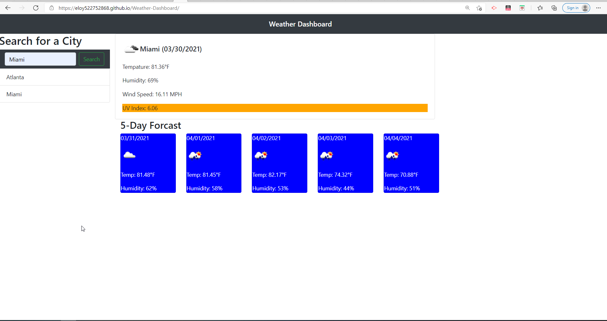

# Weather-Dashboard

## Description
On this project I access Third-party APIs for the weather dashboard app for weather daily info and 5 day forecast. Developers are often tasked with retrieving data from another application's API and using it in the context of their own. This was a great project to work server level API's.

## Deployed Site
deployed site below:

[Deployed Site](https://eloy522752868.github.io/weather-dashboard/)